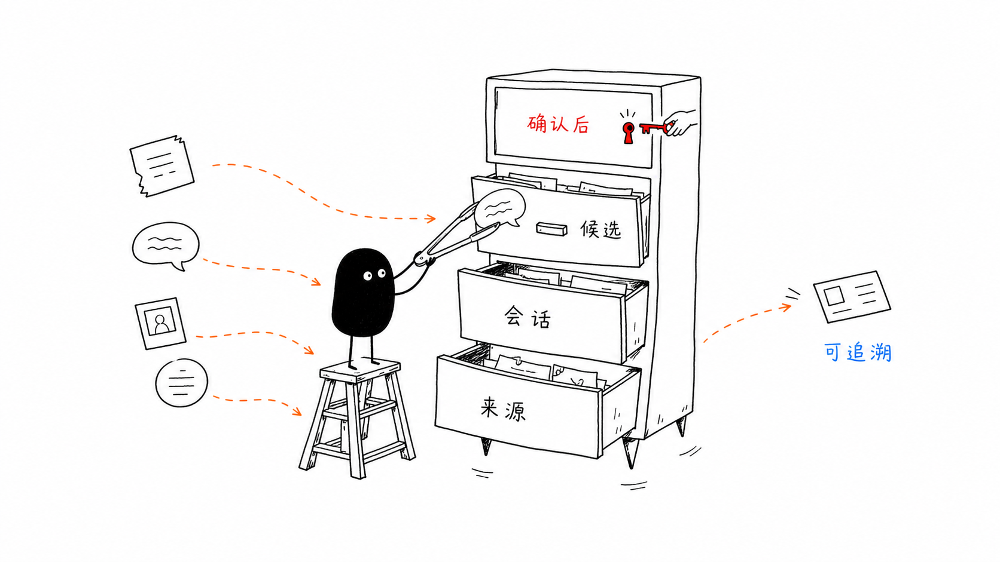
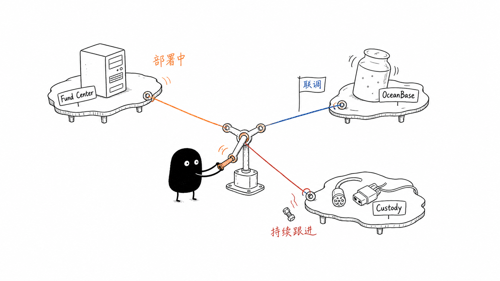
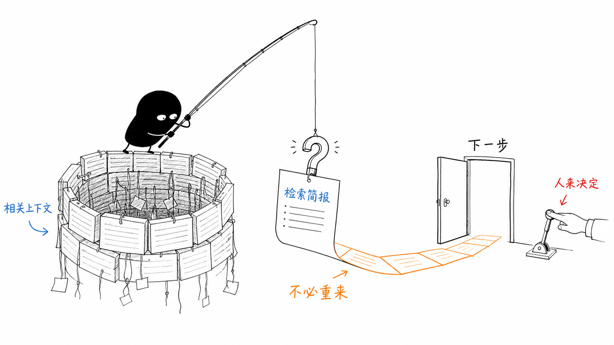

# CobrainVault 小黑风格正文配图

## 1. 分层记忆

表达 Source、Session、Candidate Memory 和 Confirmed Memory 的分层与确认机制。

## 2. 关联项目

表达 Fund Center、OceanBase 和 Bybit Custody 独立推进、彼此关联的项目状态。

## 3. 检索后继续

表达从相关上下文生成检索简报，由人决定下一步，不必每次重来。

